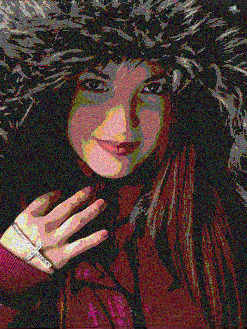

===========
pillowncase
===========

pillowncase is an experiment in hiding data in images, I had some time over the winter break and wanted to try and create a small python project end to end, learn git hub and sphinx.

I just came in on time!

----------------
How does it work
----------------

pillowncase takes any source file and then splits it up hiding the data in the low end bits of each pixel.  It takes advantage of the fact that PNG images are lossless, this would not work with JPG.

You can define how granular you want to break the data up and across which channels (RGBA).  Each pixel can hold a value between 0 and 255 for each channel in the format I'm using.  I am masking off the low end bits and spreading the data across each pixel.  The more bits replaced the less of the original image is left but the smaller the file, the less bits replaced the less you will notice the file has changed.

pillowncase is fully documented including how to set up a development environment here `pillowncase <http://pillowncase.readthedocs.io/en/latest/>`_.

A couple of examples more in the documentation.

`Fine (last 2 bits used for RGB)`

::

	pNcase -f pg29809.zip -gg -o example_one_rgb_gg.png -i katie

`Coarse (last 6 bits used for RGB)`

::

	pNcase -f pg29809.zip -gggggg -o example_three_rgb_gggggg.png -i katie

----------
Next Steps
----------

It's slow at the moment because I'm using Python to iterate over each pixel and doing lots of int to binary strings etc.  It's just a proof of concept.

Next steps are speeding the adding and extracting data up using numpy most likely and if that's not quick enough I'll look to multi thread it.

After that I'm going to have a go at doing a GUI.

have a look through the rest of the documentation and code and feel free to fork it.

----------
to do list
----------

`to do <todo.rst>`_