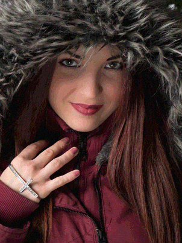
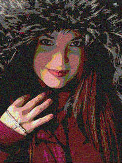
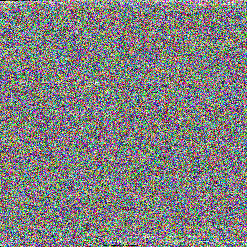
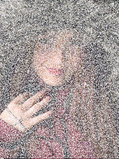

=================
About pillowncase
=================

pillowncase is an experiment in hiding data in images, I had some time over the winter break and wanted to try and create a small python project end to end.

----------------
How does it work
----------------

pillowncase takes any source file and then splits it up hiding the data in the low end bits of each pixel.  It takes advantage of the fact that PNG images are lossless, this would not work with JPG.

You can define how granular you want to break the data up and across which channels (RGBA).  Each pixel can hold a value between 0 and 255 for each channel in the format I'm using.  I am masking off the low end bits and spreading the data across each pixel.  The more bits replaced the less of the original image is left but the smaller the file, the less bits replaced the less you will notice the file has changed.

Have a play about with it following the :doc:`install` guide, I've included plenty of examples in the code documentation and more below.
	.. note:: See below how as you use more of the pixels to encode the png file trends towards the original hidden file size, when you use all bits in the image it's almost like for like.

`Fine (last 2 bits used for RGB)`

::

	python -m pillowncase -f pg29809.zip -gg -o example_one_rgb_gg.png -i katie

`Average (last 4 bits used for RGB)`

::

	python -m pillowncase -f pg29809.zip -gggg -o example_two_rgb_gggg.png -i katie

`Coarse (last 6 bits used for RGB)`

::

	python -m pillowncase -f pg29809.zip -gggggg -o example_three_rgb_gggggg.png -i katie

`All (all 8 bits used for RGB)`
	No point using an image for this one so create a square one to fit the data.

::

	python -m pillowncase -f pg29809.zip -gggggggg -o example_four_rgb_gggggggg.png

`Custom including Alpha RGBA with a distribution masking the low end bits 345 RGB and completely using the alpha channel 8`

::

	python -m pillowncase -f pg29809.zip -j 3458 -o example_five_rgba_3458.png -i katie

You if you download these actual images you can extract the zip file (:download:`pg29809.zip <_static/pg29809.zip>`) contained using the following command.
	See :doc:`install` guide for more examples of usage.

::

	python -m pillowncase -a decode -i example_two_rgb_gggg.png

----------
Next Steps
----------

It's slow at the moment because I'm using Python to iterate over each pixel and doing lots of int to binary strings etc.  It's just a proof of concept.

Next steps are speeding the adding and extracting data up using numpy most likely and if that's not quick enough I'll look to multi thread it.

After that I'm going to have a go at doing a GUI.

have a look through the rest of the documentation and code and feel free to fork it.