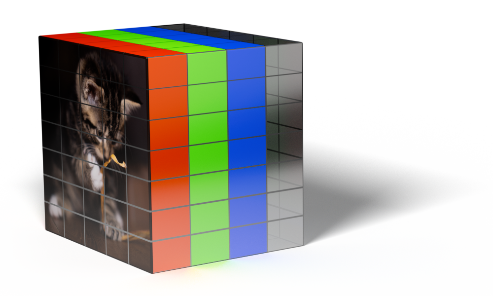

=========================
How does it work detailed
=========================

`It is important to keep in mind when looking at this case study that this is just an example of one way you can do this.  The way I have set up headers and spread the data around the image is totally arbitrary.`

--------------------------------------------------
Why are images good for storing other data
--------------------------------------------------

Images are ubiquitous in the environment and are generally allowed to move through networks with no restriction.  Images can have additional data added so they do not look any different visually.  The core Image files are genuine images the data structure is within the bounds of what the specifications define so will render as expected.

----------------------
Potential applications
----------------------

From a commercial perspective this does offer some interesting opportunities such as branded images that actually contain physical content, be that pdf's, books or other media all wrapped up in one file.  The image could itself hold a personalised encrypted token for access and other legitimate uses.

From a security point of view appropriate steps should be taken to prevent abuse.

--------------------------
How does this example work
--------------------------

At a high level PNG images are lossless they compress the image data in a similar way that a zip file would, because of this you can guarantee that the data you put in is the same as the data you get out this makes them ideal for storing any data.  There are many many other image types that work like this, TIFF, Open EXR, GIF etc. so do not just think about PNG images.

JPG images are not as suitable as they are lossy even when you set them at 100% quality some data is discarded, you would have to use a different method to hide data in JPG's which is an interesting challenge for the future.

This example focuses on RGBA (Red, Green, Blue, Alpha) channels, however there are many other ways to do this.  For example in PNG you could use the exif data (which would be easier to spot) but what could be really clever could be doing something with the channel that can contain indices to the palette of colors and so on, if you read the `specifications for PNG <https://en.wikipedia.org/wiki/Portable_Network_Graphics#Technical_details>`_. you can see lots of other possibilities.  Formats such as TIF and Open exr really are just a different data storage medium.

.. warning:: do not get fixated on this one example if you are thinking about any potential security implications, a holistic approach is required.

The data structure in the images in this example can be treated as a 3d array. Image width, height and depth (number of channels) each element can hold 8 bits of data.  I have approached this proof of concept in a very basic and slow way from a coding perspective, if you treat this problem as a proper array and use vector calculations it would be an order of magnitude faster and you could be far more creative with how you store the data.

In this case the file to be hidden is read as a raw byte stream there is no interpretation of the data it just reads it then we convert it into bits padding each byte out so it is always 8 bits long.

e.g.

.. code-block:: none

	byte stream 255,8, ... ... ...
	
becomes

.. code-block:: none

	binary stream 11111111,00001000, ... ... ...

The padding is important so we know how to read the data back.

We decide how much we want to break the file up in the image, the more we break it up the less obvious it will be but the larger the file size.

In this example we are going to store 2 bits of data in each channel of an RGB image.

Each pixel can hold 24 bits 8 Red, 8 Green, 8 Blue  (32 bits if you had an Alpha channel)

Lets say the first 2 pixels are pure white, that is 255 (FF) Red, 255 (FF) Green, 255 (FF) Blue and the first 2 bytes of data to hide are 77 (4d) 90 (5a)

In binary that is

.. code-block:: none

	          255R     255G     255B     255R     255G     255B     
	2 x Pixel 11111111 11111111 11111111 11111111 11111111 11111111
      
	          77       90
	2 x Data  01001101 01011010

We mask off the lower 2 bits for each Pixel

.. code-block:: none

	          252R     252G     252B     252R     252G     252B     
	2 x Pixel 11111100 11111100 11111100 11111100 11111100 11111100

Then we spread the data across those pixels in the lower 2 bits

.. code-block:: none

	          253R     252G     255B     253R     253G     253B       4 bits to carry over to the next pixel.
	2 x Pixel 11111101 11111100 11111111 11111101 11111101 11111101   1010

Visually this is very hard to detect as you can see with the example below and in reality this would just be at a pixel level so you would be unlikely to be able to see the variation at all.

That is the basic premise, the rest of the code just adds header data to say how long the data is and how is is spread over the pixels.

The default header is structured as follows

8888 - Number of bits used per channel this is stored a 4 bits per channel in binary and spread over the first 6 pixels one bit in each RGB channel. if the encrypt option is selected this is XOR'd with the first 2 chrs of the encryption string first.  This is always the same however if it's encrypted it's tricky to spot, it's just going to be 0 or 1 in the first bit of each channel in the first 6 pixels.

Next if it's not encrypted its the header, the header can be any length and any valid UTF-8 chr defaults to XYZZY looks for chr(02) for the end of the string.  Then the file name ending in chr(03) file name can be any valid UTF-8 encoding, then the length of the data with chr(02) and chr(03) as delimiter's followed by the data. the concatenated bytes are all converted to padded binary and spread across the pixels as defined buy the number of bits per channel.

.. code-block:: none

	8888XYZZY(02)file_name(03)(02)123456(03)raw data ... ... ...

If the file is encrypted its slightly different.

The above concatenated bytes are encrypted using Fernet and the key given then the length of that data is XOR'd with the first 5 chrs of the key and pre-pended to the encrypted data then converted to padded binary and spread across the pixels as defined by the number of bits per channel (which is now encrypted as well)

.. code-block:: none

	xor(8888)xor(encrypted_length)fernet(header and data) ... ... ...

The key is required to retrieve the data.

Refer to the :doc:`pillowncase` code for the exact process, the above is to give the idea of how it works.

